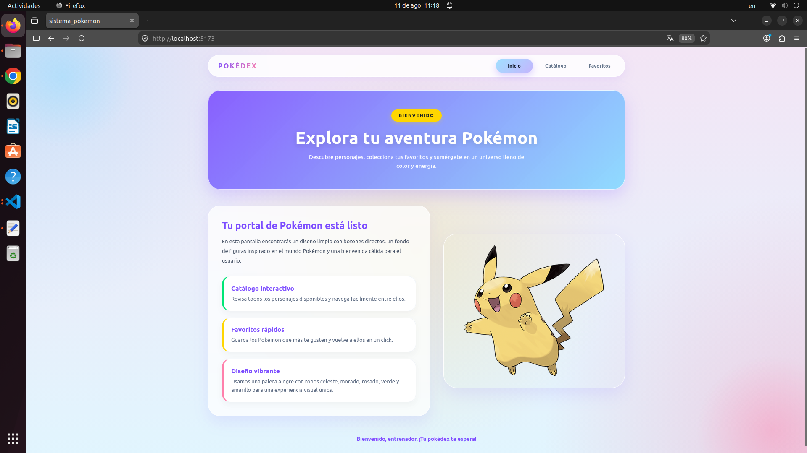
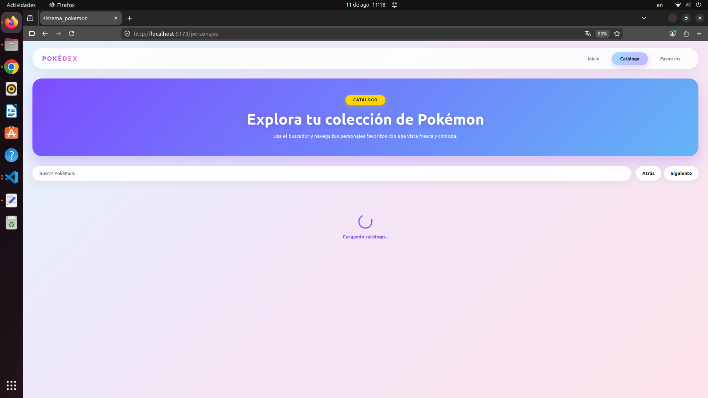
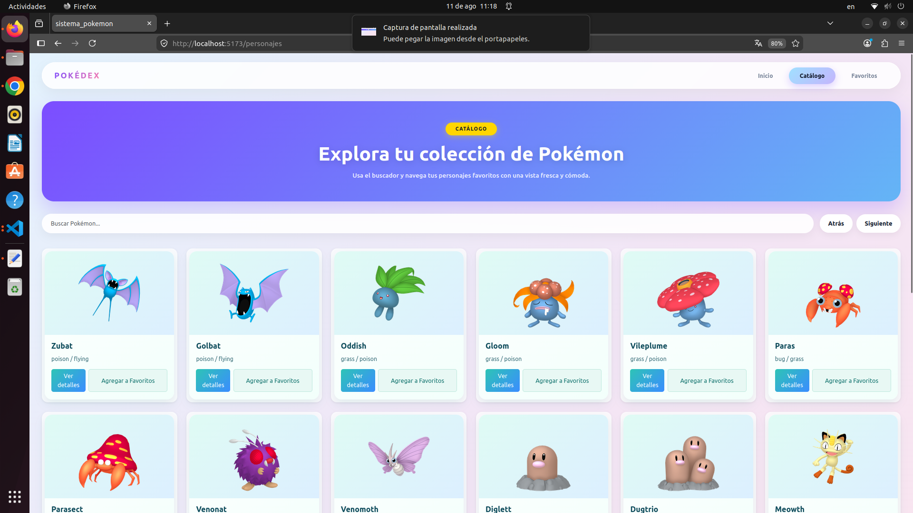
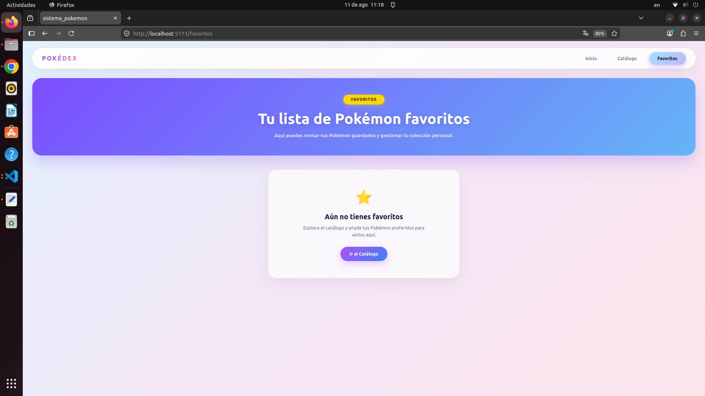

# ⚡ Pokédex Web App

Una aplicación web interactiva desarrollada con **React** y **Axios** que permite explorar la colección de Pokémon mediante el consumo de la **PokéAPI**, buscar personajes en tiempo real y gestionar tu lista de favoritos en un estado global.

---

## 🚀 Características

* **Inicio (Landing):** Presentación del proyecto con interfaz visual estilizada.
* **Catálogo de Personajes:** Muestreo dinámico de Pokémon cargados desde la API con soporte responsive.
* **Buscador en Tiempo Real:** Filtrado de personajes por nombre dentro del catálogo cargado.
* **Gestión de Favoritos:** Agrega tus Pokémon preferidos y consulta tu lista guardada mediante Context API.
* **Paginación Dinámica:** Peticiones asíncronas con offset/limit directamente a la API para navegar entre páginas.

---

## 🛠️ Tecnologías Utilizadas

* **React** (Vite / CRA)
* **Axios** (Cliente HTTP para peticiones asíncronas)
* **React Context API** (Manejo de estado global: `PokemonContext`)
* **React Router** (Navegación SPA)
* **React Bootstrap & CSS3** (Diseño y grilla responsive)
* **PokéAPI** (Consumo de datos, tipos e imágenes de Pokémon)

---

## 💻 Instalación y Ejecución

1. **Clona el repositorio:**
   ```bash
   git clone:  https://github.com/josstech-boop/Catalogo_Pokemons.git







